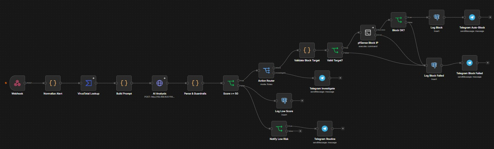

# SOC SOAR avec n8n

Automatisation de la réponse aux alertes de sécurité dans un SOC industriel simulé (IT/OT) : enrichissement de l'alerte, **score calculé par des règles**, **explication rédigée par un LLM local**, **blocage automatique sur pfSense** et **audit complet** des décisions.

> Projet réalisé dans un laboratoire virtuel (VirtualBox). Les adresses IP et les noms de machines sont ceux du laboratoire.

## Principe

**L'IA conseille, le code décide.**

Un LLM local (Ollama) ne note pas l'alerte. Il rédige l'explication pour l'analyste et peut ajuster le score de 10 points au maximum, uniquement dans la zone grise. Les décisions critiques (blocage, protection des actifs) restent déterministes, reproductibles et explicables.

Pourquoi ce choix : les modèles locaux testés (Mistral 7B, Qwen 2.5 3B et 7B) surévaluaient ou sous-évaluaient les alertes de façon instable. Un relais Tor sur une règle de niveau 15 a reçu un score de 32, une simple connexion depuis `8.8.8.8` un score de 53. Voir [docs/SCORING.md](docs/SCORING.md).

## Architecture

<!-- TODO : ajouter le schéma d'architecture dans docs/images/architecture.png -->


```text
Wazuh ──► Webhook n8n
              │
              ▼
        Normalize Alert ──► VirusTotal Lookup ──► Build Prompt (score de base)
                                                       │
                                                       ▼
                                                 AI Analysis (Ollama)
                                                       │
                                                       ▼
                                               Parse & Guardrails
                                                       │
                                                       ▼
                                                 Score >= 50 ?
                                       ┌───────────────┴───────────────┐
                                    non│                               │oui
                                       ▼                               ▼
                          Log Low Score (Postgres)              Action Router
                          Notify Low Risk (score >= 20)    ┌──────────┴──────────┐
                                  │                    Investigate             Block
                                  ▼                         │                    │
                          Telegram Routine          Telegram Investigate   Validate Block Target
                                                                                 │
                                                                           Valid Target ?
                                                                                 │ oui
                                                                                 ▼
                                                                      pfSense Block IP (SSH)
                                                                                 │
                                                                             Block OK ?
                                                                      ┌──────────┴──────────┐
                                                                   oui│                     │non
                                                                      ▼                     ▼
                                                               Log Block            Log Block Failed
                                                               Telegram Auto-Block  Telegram Block Failed
```

Si `Valid Target ?` est faux (IP invalide ou actif protégé), ou si la commande SSH échoue, le workflow passe par `Log Block Failed` puis `Telegram Block Failed`. Aucune commande n'est envoyée à pfSense pour une cible invalide.

## Pile technique

| Composant | Rôle |
|---|---|
| Wazuh | Détection et génération des alertes |
| n8n | Orchestration du workflow |
| VirusTotal (API v3) | Réputation de l'IP source |
| Ollama (`qwen2.5:7b`) | Résumé en langage clair et ajustement borné du score |
| PostgreSQL 16 | Piste d'audit (`audit_log`) |
| Telegram Bot | Notifications à l'analyste |
| pfSense | Blocage par alias et règle floating |
| Docker Compose | Déploiement de n8n, PostgreSQL et Ollama |

## Les 20 nœuds du workflow

| N° | Nœud | Type | Rôle |
|---|---|---|---|
| 1 | `Webhook` | Webhook | Reçoit l'alerte Wazuh (POST `/wazuh-alert`) |
| 2 | `Normalize Alert` | Code | Extrait 7 champs propres de l'alerte |
| 3 | `VirusTotal Lookup` | HTTP Request | Réputation de l'IP (continue en cas d'erreur) |
| 4 | `Build Prompt` | Code | Calcule le score de base, construit le prompt |
| 5 | `AI Analysis` | HTTP Request | Appelle Ollama (résumé et ajustement) |
| 6 | `Parse & Guardrails` | Code | Applique la zone grise, décide l'action |
| 7 | `Score >= 50` | If | Sépare menaces probables et faible risque |
| 8 | `Action Router` | Switch | Block ou Investigate |
| 9 | `Telegram Investigate` | Telegram | Alerte détaillée à vérifier |
| 10 | `Log Low Score` | Postgres | Enregistre les alertes à faible risque |
| 11 | `Notify Low Risk` | If | Notifie seulement les scores de 20 à 49 |
| 12 | `Telegram Routine` | Telegram | Message court sans sonnerie |
| 13 | `Validate Block Target` | Code | Valide strictement l'IP et construit la commande |
| 14 | `Valid Target?` | If | Bloque l'envoi si la cible est refusée |
| 15 | `pfSense Block IP` | SSH | Ajoute l'IP à l'alias `n8n_blocklist` |
| 16 | `Log Block` | Postgres | Audit : `blocked` |
| 17 | `Telegram Auto-Block` | Telegram | Annonce le blocage et donne la commande de déblocage |
| 18 | `Block OK?` | If | Vérifie le code de sortie de la commande |
| 19 | `Log Block Failed` | Postgres | Audit : `block_failed` ou `block_rejected` |
| 20 | `Telegram Block Failed` | Telegram | Demande une action manuelle |

## Garde-fous de sécurité

1. **Score déterministe** : calculé par le code à partir de signaux objectifs. Voir [docs/SCORING.md](docs/SCORING.md).
2. **Zone grise** : l'ajustement de l'IA (de -10 à +10) ne compte que si le score de base est entre 30 et 79, et le score final est plafonné à 79. L'IA ne peut donc jamais déclencher un blocage seule.
3. **Actifs protégés** : une liste d'IP (PLC, SCADA, Wazuh, pfSense, hôte du SOAR) n'est jamais bloquée. Elle est vérifiée deux fois (nœuds 4 et 13).
4. **Validation stricte de l'IP** : format IPv4 complet, adresses réservées refusées (`0.x`, `127.x`, multicast et plus). La commande n'est construite que depuis une IP validée, ce qui évite l'injection de commande.
5. **Entrée non fiable** : le contenu du log est déclaré non fiable dans le prompt.
6. **Vérification du résultat** : `Block OK?` contrôle le code de sortie, donc le workflow n'annonce jamais un blocage qui n'a pas eu lieu.
7. **Moindre exposition** : n8n et Ollama écoutent uniquement sur l'interface Host-Only, SSH vers pfSense par clé, règle de pare-feu limitée à l'hôte du SOAR.

## Base d'audit

Table `audit_log` (voir [sql/init.sql](sql/init.sql)) :

| Statut | Signification |
|---|---|
| `false_positive` | Score sous 20 |
| `low_risk` | Score de 20 à 49 |
| `blocked` | IP ajoutée à la liste de blocage de pfSense |
| `block_failed` | La commande vers pfSense a échoué |
| `block_rejected` | Cible refusée (IP invalide ou actif protégé) |

## Installation

### 1. Services (n8n, PostgreSQL, Ollama)

```bash
cd docker
cp .env.example .env        # puis modifier les valeurs
docker compose up -d
docker exec -it ollama ollama pull qwen2.5:7b
```

n8n est disponible sur `http://<HOST_IP>:5678`, Ollama sur `http://<HOST_IP>:11434`.

### 2. Base de données

```bash
docker exec -i postgres-soc psql -U <POSTGRES_USER> -d <POSTGRES_DB> < ../sql/init.sql
```

### 3. Credentials n8n

À créer dans n8n (jamais dans le dépôt) : PostgreSQL, VirusTotal (clé API), Telegram (token du bot), SSH (clé privée vers pfSense).

### 4. Workflow

Importer le fichier de [workflow/](workflow/), puis :
1. Associer les credentials aux nœuds.
2. Remplacer le **Chat ID** Telegram dans les 4 nœuds Telegram.
3. Vérifier que les listes `PROTECTED_IPS` des nœuds `Build Prompt` et `Validate Block Target` sont identiques et adaptées à votre réseau.

### 5. pfSense

Voir [docs/pfsense.md](docs/pfsense.md) : interface de gestion, alias `n8n_blocklist`, règle floating, accès SSH par clé.

### 6. Intégration Wazuh

> Section à compléter après validation sur le laboratoire.

Piste de configuration (bloc `<integration>` du Manager, qui envoie l'alerte au format JSON vers le webhook) :

```xml
<integration>
  <name>shuffle</name>
  <hook_url>http://<HOST_IP>:5678/webhook/wazuh-alert</hook_url>
  <level>10</level>
  <alert_format>json</alert_format>
</integration>
```

## Tests

Quatre scénarios documentés dans [docs/TESTS.md](docs/TESTS.md) : faible risque, investigation, blocage réussi, blocage en échec.

## Limites connues

1. **Compte `root` pour le SSH** : le compte `admin` de pfSense n'exécute pas les commandes à distance. Le compte `root` a les mêmes droits. Amélioration prévue : compte dédié avec `sudo` restreint à `pfctl -t n8n_blocklist -T add`.
2. **Table `pfctl` non persistante** : les IP ajoutées peuvent disparaître après un redémarrage de pfSense ou un rechargement complet des règles.
3. **Pas d'audit des investigations** : la branche `investigate` envoie un message Telegram mais n'écrit pas dans `audit_log`.
4. **Modèle local sur CPU** : environ une minute par alerte avec `qwen2.5:7b`.
5. **Mode Markdown de Telegram** : un résumé contenant des `_` ou `*` en nombre impair peut faire refuser le message.
6. **Clé de chiffrement n8n** : à remplacer par une valeur aléatoire forte avant toute utilisation réelle.

## Améliorations prévues

1. Compte SSH dédié avec `sudo` restreint.
2. Persistance de la liste de blocage et expiration automatique des blocages.
3. Audit de la branche `investigate`.
4. Rapport d'incident par email (résumé rédigé par l'IA, modèle HTML rempli par le code).
5. Enrichissement MITRE ATT&CK for ICS.

## Structure du dépôt

```text
soc-soar-n8n/
├── README.md
├── docker/
│   ├── docker-compose.yml
│   └── .env.example
├── sql/
│   └── init.sql
├── workflow/            (export JSON du workflow n8n)
└── docs/
    ├── SCORING.md
    ├── TESTS.md
    ├── pfsense.md
    └── images/          (schéma et captures)
```

## Auteure

Fatima Ezzahra EL HASNAOUI, étudiante ingénieure en sécurité informatique et confiance numérique (ENSIASD). GitHub : [@Timzy0xDEAD](https://github.com/Timzy0xDEAD)
